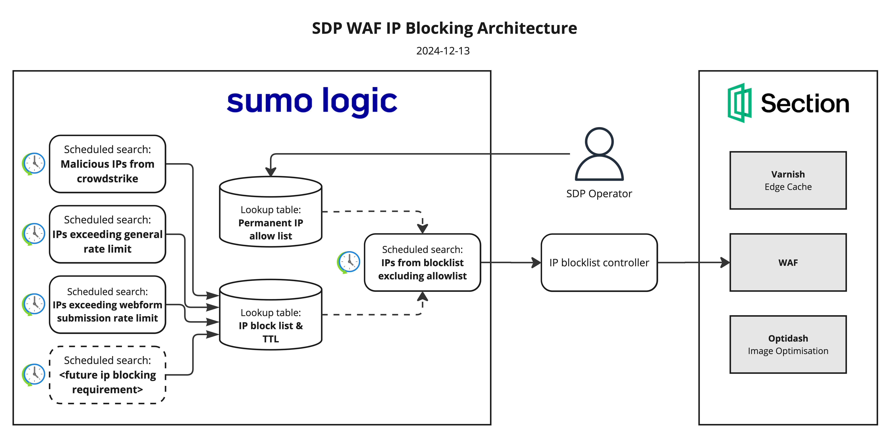

# Section IP Block Controller

This application launches a webserver listening for POST requests to `/v1/ip/add`. Typically requests to this endpoint originate from a SumoLogic webhook connection.

The payload expected by this endpoint is a json object that looks something like this

```
{
    "results": "[{\"cidr\":\"1.2.3.4/32\"},{\"cidr\":\"4.5.6.7/32\"}]"
}
```

The `results` value should be a string-encoded json object. This is weird, but its a limitation of SumoLogic's webhook feature.

## Solution Architecture

This diagram shows the high-level solution architecture. This application is the `IP blocklist controller` component.



## Installation

## Usage

```
$ bay-section-ip-controller -h

Usage of bay-section-ip-controller:
  -a string
        Comma separate list of applications to update
  -b string
        Comma separated list of IPs to always include in the blocklist
  -debug
        Sets log level to debug
  -e string
        Comma separated list of environments to update (default "Develop")
  -i string
        Account ID for Section API
  -p string
        TCP listen port (default "80")
  -t string
        Token for Section API (default os.Getenv("SECTION_IO_TOKEN"))
```

## Local development

### Build

```sh
git clone git@github.com:dpc-sdp/bay-section-ip-controller.git && cd bay-section-ip-controller
go generate ./...
go build -ldflags="-s -w" -o build/bay-section-ip-controller .
go run . -h
```